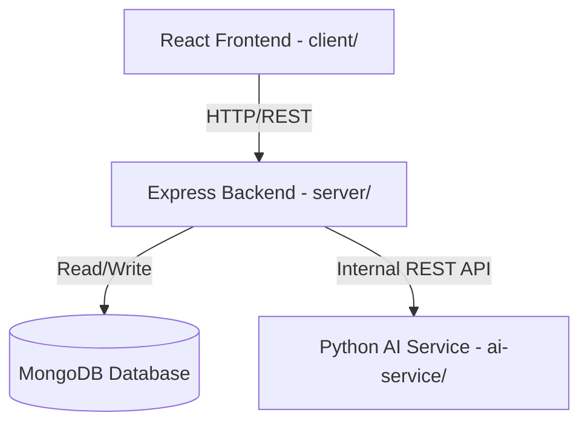

# HR-Flow: AI-Powered Human Resource Management (HRM) Platform

HR-Flow is a comprehensive, enterprise-ready Human Resource Management (HRM) system designed to streamline recruitment, employee tracking, task allocation, and performance monitoring. Leveraging a modern web stack and intelligent AI engines, HR-Flow optimizes resource utilization, automates candidate screening, and alerts teams to potential operational risks.

---

## 🏛️ Architecture Overview

The system is structured as a decoupled monorepo comprising three core services:



- **Frontend (`/client`)**: React single-page application built with Vite, TypeScript, Tailwind CSS, and Redux Toolkit.
- **Backend (`/server`)**: Express.js server providing RESTful APIs, JWT role-based authentication, and orchestration.
- **AI Service (`/ai-service`)**: Python FastAPI microservice utilizing OpenRouter (GPT-4o / Llama 3.3) for CV parsing and candidate matching.
- **Database**: MongoDB (Mongoose ORM) for persistent data storage.

---

## 🚀 Key Features

- **AI-Powered CV Parsing & Filtering**: Automated resume text extraction and skill/education mapping matching active Job Descriptions.
- **Employee & Profile Management**: Comprehensive tracking of employee records, skills, departments, and roles.
- **Project & Task Allocation**: Interactive boards for managing projects, task assignments, and progress monitoring.
- **AI Resource Allocation**: Smart recommendation engine advising manager on optimal team allocation based on availability, workload, and skillsets.
- **Attendance & Leave Management**: Track clock-ins, clock-outs, total working hours, and automated leave request/approval workflow.
- **Risk Dashboard & Notifications**: Alerts for overloaded employees, looming deadlines, activity logs, and system auditing.
- **Reporting & Analytics**: Comprehensive dashboards and downloadable summary reports (CSV/PDF).

---

## 📁 Repository Structure

```
HRFlow-HRM/
├── client/                 # React frontend (Vite + TypeScript)
│   ├── src/                # Component & state logic
│   └── package.json
├── server/                 # Express.js backend API
│   ├── models/             # Mongoose schemas
│   ├── routes/             # Express routes & middlewares
│   └── package.json
├── ai-service/             # FastAPI/Flask AI Microservice
│   ├── parsers/            # Resume NLP parsing models
│   └── requirements.txt    # Python dependencies
├── docs/                   # Backlog CSVs, diagrams, and guides
│   ├── github_setup_guide.md
│   └── jira_import.csv
└── .github/                # PR & Issue templates
```

---

## ⚙️ Quick Start & Installation

### 1. Prerequisites
- [Node.js](https://nodejs.org/) (v18+)
- [Python](https://www.python.org/) (v3.10+)
- [MongoDB](https://www.mongodb.com/) (Local or Atlas Instance)
- [GitHub CLI](https://cli.github.com/) (For project management synchronization)

---

### 2. Service Setup

#### 💻 Frontend (`/client`)
1. Navigate to the client directory:
   ```bash
   cd client
   ```
2. Install dependencies:
   ```bash
   npm install
   ```
3. Create a `.env` file based on environment requirements and run in development mode:
   ```bash
   npm run dev
   ```

#### ⚙️ Backend (`/server`)
1. Navigate to the server directory:
   ```bash
   cd server
   ```
2. Install dependencies:
   ```bash
   npm install
   ```
3. Setup your `.env` configuration (MongoDB URI, JWT secret, and port).
4. Run the development server:
   ```bash
   npm run dev
   ```

#### 🤖 AI Service (`/ai-service`)
1. Navigate to the AI service directory:
   ```bash
   cd ai-service
   ```
2. Set up a Python virtual environment:
   ```bash
   python -m venv venv
   source venv/bin/activate  # On Windows: .\venv\Scripts\activate
   ```
3. Setup your `.env` configuration:
   - Create `.env` and add `OPENROUTER_API_KEY=your_openrouter_key`
4. Install dependencies:
   ```bash
   pip install -r requirements.txt
   ```
5. Start the service (runs on port 8000):
   ```bash
   python main.py
   ```

---

## 🤝 Development Workflow & Guidelines

Our team follows strict branch naming conventions and automated board workflows:
- **Main Branch**: `main` (Stable/Production)
- **Development Branch**: `dev` (Sprint Integration)
- **Feature Branches**: `feature/<story-number>-<short-description>`
- **Bugfixes**: `bugfix/<issue-number>-<short-description>`

Please consult our [GitHub Setup & Workflow Guide](file:///a:/HRFlow-HRM/docs/github_setup_guide.md) for detailed information regarding team allocations, automation columns, and running our Jira-to-GitHub issue importer script.
